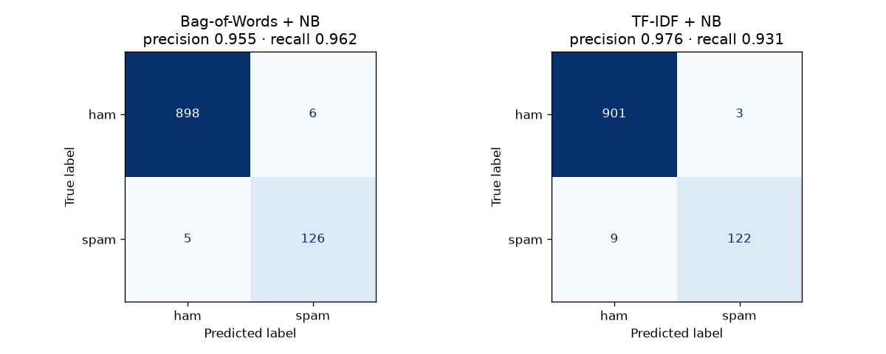
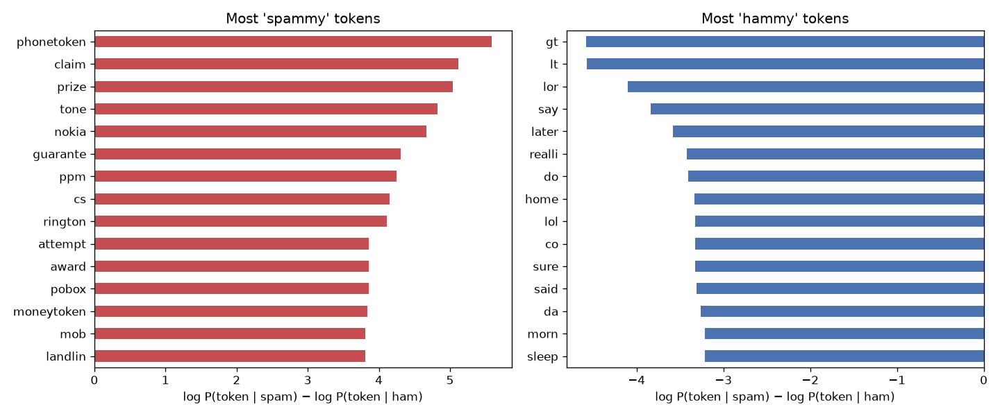

# 📩 Spam Classifier (SMS / Email)

A classic NLP starter project: classify a message as **spam** or **ham** (not spam) using traditional text features (Bag-of-Words and TF-IDF) and a Naive Bayes classifier. No deep learning, and it still gets about 99% accuracy.

**Dataset:** the UCI [SMS Spam Collection](https://archive.ics.uci.edu/dataset/228/sms+spam+collection), 5,574 real text messages collected in the UK and Singapore. After removing duplicate messages, 5,169 remain (13% spam). The same pipeline works on emails; SMS just makes for a cleaner, freely available dataset.

## Results (test set, 1,035 messages)

| Model | Best settings | CV F1 | Accuracy | Spam precision | Spam recall | Spam F1 |
|---|---|---|---|---|---|---|
| **Bag-of-Words + Multinomial NB** | unigrams, α = 1.0 | **0.948** | **98.9%** | 0.955 | **0.962** | **0.958** |
| TF-IDF + Multinomial NB | unigrams, min_df = 2, α = 0.3 | 0.940 | 98.8% | **0.976** | 0.931 | 0.953 |

Only **11 messages out of 1,035** were misclassified.

I expected TF-IDF to win, and it didn't. Plain word counts did slightly better overall. Naive Bayes is literally a model of word *counts*, so feeding it TF-IDF weights is a bit of a mismatch. TF-IDF did give **higher precision** (fewer real messages marked as spam), though. For a real spam filter that's arguably the number you care about most, because losing a message from a friend is much worse than seeing one extra spam. So the "best" model depends on which mistake you'd rather make.



## Text cleaning pipeline

```
"WINNER!! Claim your £1000 prize, call 09061701461 now www.prizes.com"
        │ lowercase
        │ URLs → urltoken, emails → emailtoken
        │ £1000 → moneytoken, 09061701461 → phonetoken, other numbers → numtoken
        │ strip punctuation
        │ remove stopwords (sklearn's English list)
        │ Porter stemming  (winner → winner, claim → claim, prizes → prize)
        ▼
"winner claim moneytoken prize phonetoken urltoken"
```

The placeholder tokens were the most useful idea here. The model doesn't care *which* phone number appears, but "this message contains a long phone number and a money amount" is about the strongest spam signal there is. Without the placeholders, every number would be a separate, rarely seen word.

## What spam looks like

| | Ham (median) | Spam (median) |
|---|---|---|
| Length | 53 chars | 148 chars |
| Digits | 0 | 16 |
| Capital letters | 3.4% | 9.8% |



The most "spammy" tokens (after stemming) are `phonetoken`, `claim`, `prize`, `tone`, `nokia`, `guarante`, `ppm` (pence per minute), `cs` (customer service), `rington` and `attempt` (as in "2nd attempt to contact you"). The most "hammy" ones are casual chat: `gt` / `lt` (HTML leftovers in personal messages), `lor`, `say`, `later`, `realli`, `lol`, `home`.

## Looking at the mistakes

`outputs/misclassified.csv` lists every error, and reading them was the most educational part:

- *"Nokia phone is lovly.."* (ham → flagged as spam at 96%). `nokia` is one of the top-5 spam tokens because of all the phone-upgrade spam.
- *"Have you laid your airtel line to rest?"* (ham → spam). A telecom brand name again.
- A spam quiz about *The Simpsons Movie* got through as ham. It reads like a normal sentence, with no money, no phone number and no "WIN".

A bag-of-words model has no idea about context, so it gets fooled by vocabulary. That's the honest limit of this approach.

## Project structure

```
04-spam-email-classifier/
├── src/
│   ├── data.py         # download + de-duplicate the dataset
│   ├── preprocess.py   # cleaning: placeholders, stopwords, stemming
│   ├── eda.py          # length/digits/caps stats, top tokens per class
│   ├── train.py        # BoW vs TF-IDF + NB grid search, evaluation, plots
│   └── predict.py      # classify any message from the command line
├── tests/
├── outputs/            # metrics.json, misclassified.csv, figures/
└── models/
```

## Run it

The dataset downloads automatically the first time you run anything (it's small), and the trained model is already included, so `predict` works straight away.

```bash
git clone https://github.com/Aditya11-11/spam-email-classifier.git
cd spam-email-classifier
python -m venv .venv && source .venv/bin/activate   # Windows: .venv\Scripts\activate
pip install -r requirements.txt

python -m src.eda
python -m src.train
python -m src.predict "WINNER!! You have been selected for a £1000 prize. Call 09061701461 now" \
                      "hey are we still on for lunch tomorrow?"
# [SPAM  p(spam)=1.000]  WINNER!! You have been selected for a £1000 prize. Call 09061701461 now
# [ ham  p(spam)=0.000]  hey are we still on for lunch tomorrow?
pytest -q
```

## Why I dropped duplicates

About 400 messages appear more than once (the same spam blast sent to many people). If you leave them in, identical messages land in both the training and the test set, and the model gets graded partly on messages it has literally memorised. Removing them costs about 0.3% of "accuracy" but makes the number honest.

## If I took this further

- Linear SVM or Logistic Regression on TF-IDF with bigrams. These usually beat NB by a little.
- Add simple hand-made features (length, digit count, capital-letter ratio). The table above shows they separate the classes well.
- Tune the decision threshold for a target false-positive rate, e.g. "at most 1 in 1,000 real messages flagged".

---

## Part of a series

This is one of five ML projects I built while learning machine learning, each in its own repo:

- [🌸 Iris Flower Classification](https://github.com/Aditya11-11/iris-flower-classification)
- [🏠 House Price Prediction](https://github.com/Aditya11-11/house-price-prediction)
- [📉 Customer Churn Prediction](https://github.com/Aditya11-11/customer-churn-prediction)
- [📩 Spam Classifier](https://github.com/Aditya11-11/spam-email-classifier) ← you are here
- [✍️ Handwritten Digit Recognition (MNIST)](https://github.com/Aditya11-11/mnist-digit-recognition)

MIT licensed. See [LICENSE](LICENSE).
